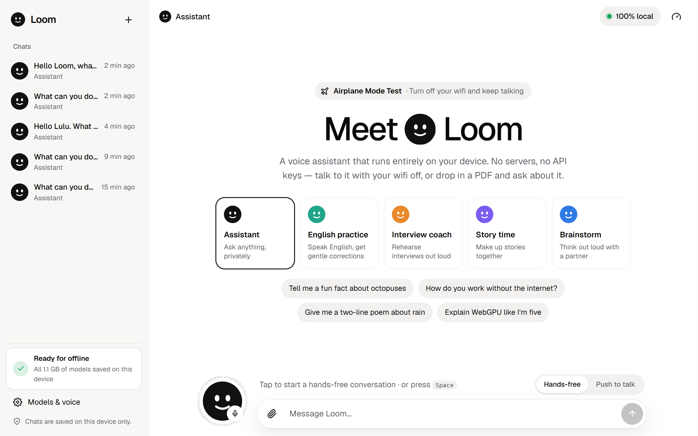
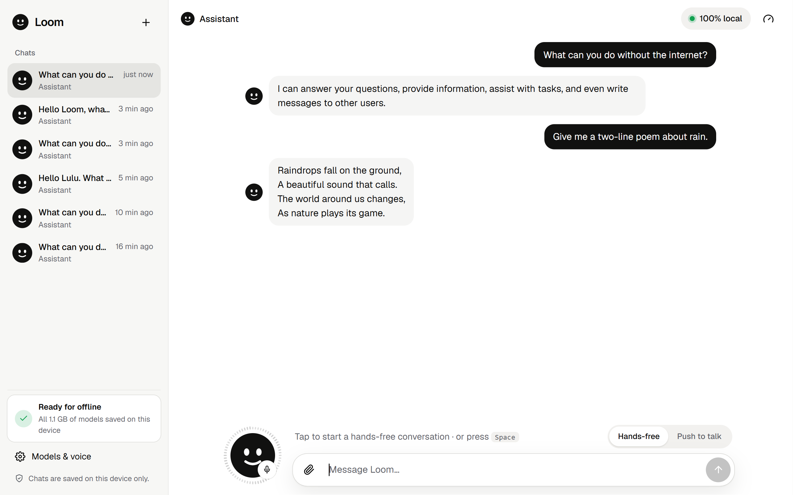
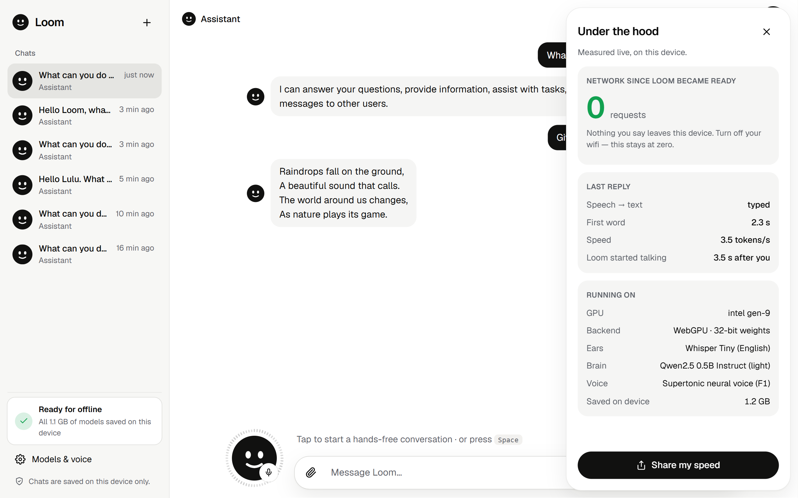
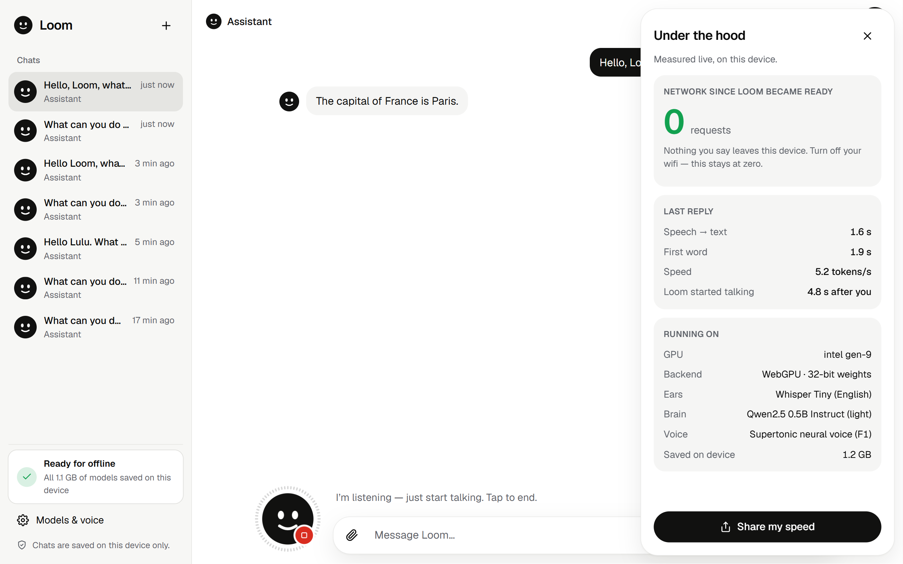
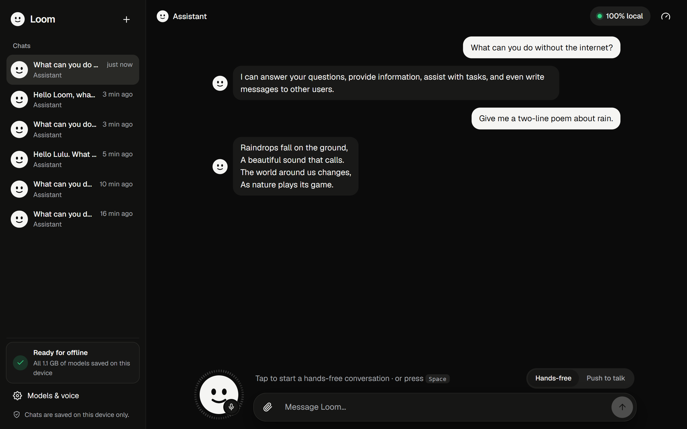
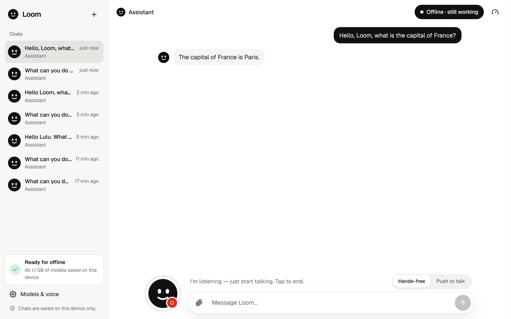
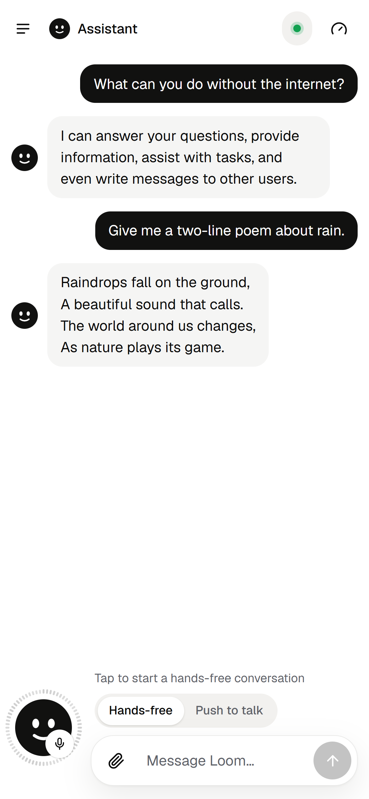
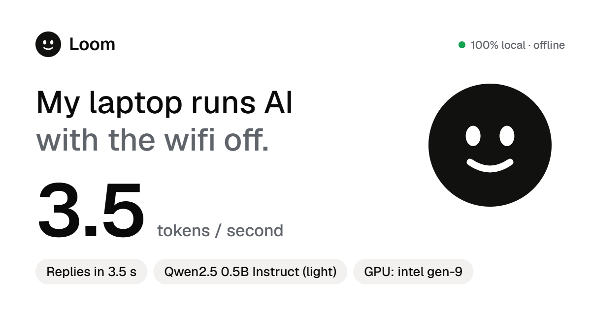
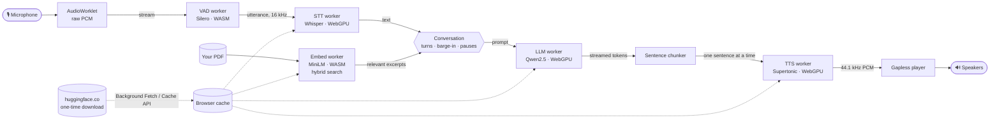

<div align="center">

# Loom

**Talk to an AI with your wifi off — 100% local, in your browser.**

[](https://github.com/Niloy-Bhuiyan/loom/actions/workflows/deploy.yml)


[](LICENSE)



</div>

Loom is a voice assistant that runs entirely inside a browser tab. Your speech is
transcribed, answered and spoken back by AI models running on **your own GPU via
WebGPU**. There is no server, no API key, and nothing you say leaves your device —
switch on airplane mode and keep talking.

<!-- TODO: record and embed a demo GIF here showing wifi being turned off mid-conversation -->

**▶ Live demo:** `https://niloy-bhuiyan.github.io/loom/` *(after enabling GitHub Pages — see [Deploying](#deploying-github-pages))*

## What makes it interesting

This isn't a UI on top of an API. Every piece below runs in the browser:

| | How |
| --- | --- |
| **Seven models / workers, no server** | Whisper (speech-to-text), Qwen2.5 (reasoning), Supertonic (neural voice), Silero (voice detection), MiniLM (document search) — each in its own Web Worker on WebGPU or WASM, behind swappable TypeScript interfaces. |
| **Speaks while it thinks** | LLM tokens stream into a sentence chunker; each finished sentence is synthesized and played while the next is still being generated. |
| **Talks like a phone call** | Silero VAD decides when you start and stop. Pauses mid-thought are merged (the half-heard message is withdrawn and re-transcribed with the rest); talking over Loom interrupts it; stricter thresholds while it speaks stop it hearing itself. |
| **Private RAG** | Drop in a PDF; pdf.js + MiniLM embeddings + a hybrid keyword/vector search answer questions about it — the file never leaves the tab. |
| **Proves it's local** | An *Under the hood* panel shows live timings, tokens/sec, the GPU in use — and counts network requests since Loom became ready. It stays at **0**. |
| **Works offline, even the first reload** | Models, ONNX Runtime and the app shell are cached; **Background Fetch** keeps multi-GB downloads going after the tab is closed. |
| **Defends against real hardware** | A warm-up self-test caught a GPU whose 16-bit math returns garbage ("2 + 2 = 10") and transparently switches it to 32-bit weights. |
| **Starts fast** | A light brain loads first; the bigger one downloads in the background and swaps in between turns. |

Numbers: **140+ commits · 137 unit tests · TypeScript strict · ~5,600 lines of TS · 87 KB main bundle** (models load on demand).

## Screenshots

| Conversation | Under the hood (live proof) |
| --- | --- |
|  |  |
| **Network off — still answering** | **Dark mode** |
|  |  |
| **Hands-free voice** | **Phone** |
|  |  |

The shareable speed card Loom generates from your last reply:



All screenshots were captured from real runs in Chrome on an Intel UHD integrated
GPU (see [How the screenshots were made](#how-the-screenshots-were-made)).

## Demo it in an interview (or anywhere)

The models download **once per browser**, not per visit — so prepare beforehand:

1. **The day before**, open Loom in Chrome on your laptop and click
   **Download in the background**. You can close the tab; Chrome keeps
   downloading and shows it in its downloads bar.
2. Check the sidebar says **✓ Ready for offline**. Optionally click **Install**
   so Loom opens like a native app.
3. **Just before the interview**, open Loom and let it start (it loads from disk,
   but warming up the GPU takes ~30 s on an integrated GPU — do it before
   you share your screen). Then pick a mode, tap the orb and talk.
4. Open **Under the hood** so they can see the network counter at 0 — then
   **turn off your wifi** and keep talking.
5. Drop in a PDF (a job description works well) and ask about it out loud.
6. Keep a short screen recording as a backup, in case the demo machine misbehaves.

## Features

- 📞 **Hands-free, like a phone call** — just talk; on-device voice detection (Silero VAD) knows when you start, pause and finish, and you can cut Loom off mid-sentence
- 📄 **Talk to your documents** — drop in a PDF or text file and ask about it out loud; it's read, indexed and searched entirely on your device
- 🎭 **Modes** — Assistant, **English practice** (gentle corrections), **Interview coach**, **Story time** and **Brainstorm**
- 💾 **Saved chats** — conversations are kept in your browser (IndexedDB), never uploaded
- ⚡ **Fast start** — starts talking with a light model while the smarter one downloads in the background, then swaps it in
- 📲 **Installable** — add Loom to your desktop or home screen and use it like an offline app
- 🛰️ **Download in the background** — close the tab and Chrome keeps downloading; the sidebar shows **Ready for offline** when everything is on disk
- 🔍 **Under the hood** — live speech-to-text time, time to first word, tokens/sec, reply latency, GPU, and a network-request counter; plus a shareable speed card
- 🎙️ **Speech in** — Whisper on WebGPU · 🧠 **Reasoning** — Qwen2.5 (up to Qwen3 4B) on WebGPU · 🔊 **Speech out** — Supertonic neural TTS on WebGPU
- ✈️ **Offline after first load** — models, runtime and app shell are all cached
- 🧩 **Swappable stages** — each model sits behind a small TypeScript interface

## Quickstart

Requires Node.js 20.19+ (or 22.12+) and a [WebGPU-capable browser](#hardware--browser-requirements).

```bash
npm install && npm run dev
```

Open the printed `http://localhost:5173` URL and click **Download & start**. The
first visit downloads about 0.9 GB so you can start talking with the light
brain; the default brain (~1.2 GB) then downloads in the background and takes
over automatically. Tap the big button and just talk — or switch to
**Push to talk** and hold the button (or <kbd>Space</kbd>) instead.

### The Airplane Mode Test

1. Load Loom once while online so the models are cached.
2. Turn off wifi / enable airplane mode.
3. Keep talking. The badge in the corner switches to **Offline · still working**
   — and so does Loom.

Other scripts:

| Command | What it does |
| --- | --- |
| `npm run build` | Type-check and build the static site into `dist/` |
| `npm run preview` | Serve the production build locally |
| `npm test` | Run the unit tests (Vitest) |
| `npm run typecheck` | TypeScript strict-mode check only |

## How it works



Everything inside the diagram runs in the browser tab. The dotted lines are the
only network use: downloading model files once, into the Cache API.

1. **Capture.** While you hold the button, an inline `AudioWorklet` records raw
   PCM from the microphone. On release, audio is resampled to 16 kHz. Silent or
   very short clips are skipped (Whisper hallucinates on silence).
2. **Speech-to-text.** The clip is sent to a Web Worker running Whisper through
   [Transformers.js](https://github.com/huggingface/transformers.js) on WebGPU.
3. **Reasoning.** The transcript plus recent history goes to a second worker
   running Qwen2.5-1.5B-Instruct. Tokens stream back as they're generated and
   appear live in the transcript.
4. **Text-to-speech.** Streamed text is cut into sentences. Each finished
   sentence is cleaned of markdown/emoji and synthesized by Supertonic in a third
   worker, *while the LLM is still writing the next sentence*, then played back
   gaplessly. That overlap is what makes it feel conversational.
5. **Barge-in.** Start talking while Loom is thinking or speaking and it stops
   immediately (the LLM is interrupted and queued audio is dropped).

### Hands-free listening

In hands-free mode the mic stream goes straight from an AudioWorklet to a small
worker running **Silero VAD** (2 MB, bundled with the app, run on WASM). It
decides when you start and stop talking — no button. Details that make it feel
natural:

- Speech must last ~200 ms before it counts, so coughs and clicks are ignored,
  and ~300 ms of audio before that point is kept so first syllables aren't cut.
- ~0.8 s of silence ends your turn. If you keep talking *before Loom starts
  answering*, it treats that as a pause: the half-heard message is withdrawn
  and both parts are transcribed together.
- While Loom is speaking, the detector demands clearer, longer speech before
  it lets you interrupt, so Loom's own voice through your speakers doesn't
  cut itself off. (Headphones make this perfect.)

### Talk to your documents

Drop a PDF, `.txt` or `.md` file anywhere on the page (or use the 📎 button):

1. **pdf.js** extracts the text in the browser (loaded only when needed).
2. The text is split into overlapping, sentence-aligned passages.
3. A 23 MB **MiniLM** embedding model turns each passage into a vector (CPU/WASM,
   so it doesn't compete with the chat model for GPU memory).
4. For each question, passages are ranked by a **hybrid** of embedding similarity
   and keyword overlap; the best few are added to the prompt. Short documents
   are simply given to the model whole.

The file never leaves the tab. Documents stay loaded for the session.

### Why it's all local

- Inference happens in Web Workers using WebGPU compute shaders on your GPU.
  There is no inference server — the site is plain static files.
- The only network requests are the **one-time downloads** of model weights
  from the Hugging Face Hub (and ONNX Runtime's WASM from the jsDelivr CDN).
  Transformers.js stores them in the browser's Cache API; after that, loading is
  from disk.
- A small service worker caches the app itself, so the page reloads offline too.
- The optional Web Speech fallback voice only uses voices that report
  `localService: true`, so it can't quietly send your text to a cloud TTS.

### Project layout

```
src/
  pipeline/types.ts      SpeechToText, LanguageModel, TextToSpeech interfaces
  agent/                 Conversation orchestration (turns, barge-in, pauses) + prompts
  stt/                   Whisper worker + client
  llm/                   Text-generation worker, f16 self-test, fast start, background prefetch
  tts/                   Supertonic worker + client, Web Speech fallback, factory
  vad/                   Silero VAD worker, speech segmenter, hands-free controller
  docs/                  PDF/text extraction, chunking, embeddings, hybrid search
  chats/                 Saved conversations (IndexedDB)
  offline/               Offline plan, readiness check, Background Fetch + in-tab downloads
  audio/                 Mic capture, streaming resampler, PCM playback
  workers/               Shared worker message protocol
  core/                  Capability detection, errors, progress, caching, network monitor, text utils
  ui/                    Layout, face mascot, transcript, waveform, loader, proof panel, speed card, dialogs
  config/                Model presets, modes and persisted settings
```

## Modes

Pick one on the welcome screen; Loom greets you out loud and suggests how to start.

| Mode | What it's for |
| --- | --- |
| 💬 Assistant | General questions, privately |
| 🗣️ English practice | Speak English; Loom gently rephrases mistakes, then keeps the conversation going |
| 🎯 Interview coach | One interview question at a time, with a strength and an improvement after each answer |
| 📖 Story time | Make up stories together, a few sentences at a time |
| 💡 Brainstorm | Two or three concrete ideas at a time, plus a question to go deeper |

Modes are just a persona prompt and starter prompts in
[`src/config/modes.ts`](src/config/modes.ts) — adding one takes a few lines.

## Models (and how to swap them)

| Stage | Default | Size (download) | Alternatives in settings |
| --- | --- | --- | --- |
| Speech-to-text | `onnx-community/whisper-base.en` | ~210 MB | `whisper-tiny.en` (~120 MB), `whisper-small.en` (~590 MB) |
| Language model | `onnx-community/Qwen2.5-1.5B-Instruct` (q4f16) | ~1.2 GB | `Qwen2.5-0.5B-Instruct` (~500 MB, also the fast-start brain), `Qwen3-4B-Instruct-2507` (~2.9 GB, "pro") |
| Text-to-speech | `onnx-community/Supertonic-TTS-ONNX` | ~265 MB | Built-in browser voice (on-device voices only) |
| Voice detection | Silero VAD v5 (bundled) | 2 MB | — |
| Document search | `Xenova/all-MiniLM-L6-v2` (q8, on demand) | 23 MB | — |

The **text-to-speech engine actually used by default is Supertonic**, a neural
TTS model running locally through Transformers.js. The browser's Web Speech
`SpeechSynthesis` is a documented fallback: you can select it in settings, and
Loom switches to it automatically if Supertonic can't load. See
[DESIGN_NOTES.md](DESIGN_NOTES.md) for the reasoning behind every choice.

**Use a larger Whisper for accuracy:** open the settings (⚙) and choose
*Whisper Small*, or add any Transformers.js-compatible Whisper checkpoint to
`STT_PRESETS` in [`src/config/models.ts`](src/config/models.ts), e.g.:

```ts
{
  id: 'whisper-large-v3-turbo',
  label: 'Whisper Large v3 Turbo (multilingual)',
  model: 'onnx-community/whisper-large-v3-turbo',
  approxMB: 1100,
  dtype: { encoder_model: 'fp16', decoder_model_merged: 'q4' },
},
```

**Swap the LLM:** add an entry to `LLM_PRESETS` with any ONNX text-generation
model that Transformers.js supports on WebGPU (look for `q4f16` weights).

**Swap a whole stage:** implement the matching interface from
[`src/pipeline/types.ts`](src/pipeline/types.ts) and construct it in
[`src/app.ts`](src/app.ts) (or [`src/tts/index.ts`](src/tts/index.ts) for voices).
Nothing else needs to change.

## Hardware & browser requirements

Loom needs **WebGPU**:

| Browser | Status |
| --- | --- |
| Chrome / Edge 113+ | ✅ Windows, macOS, ChromeOS |
| Chrome 121+ on Android | ✅ recent devices |
| Safari 26+ | ✅ macOS, iOS, iPadOS |
| Firefox 141+ | ✅ Windows; other platforms rolling out |
| Chrome on Linux | ⚠️ may need `chrome://flags/#enable-unsafe-webgpu` |

If WebGPU isn't available, Loom shows a friendly explanation instead of loading.

**GPU memory (VRAM) — rough guide:**

| Setup | Download | GPU memory |
| --- | --- | --- |
| Default (Whisper base + Qwen2.5 1.5B + Supertonic) | ~1.7 GB | ~2.5–3 GB |
| Light (Whisper tiny + Qwen2.5 0.5B + Supertonic) | ~0.9 GB | ~1.5 GB |

- Integrated GPUs (Intel Xe/Arc, AMD, Apple M-series) share system RAM; 8 GB
  of system memory is a comfortable minimum, 16 GB is better.
- GPUs **with** the `shader-f16` feature use smaller `q4f16` weights. Without
  it Loom automatically uses `q4` weights (larger, ~1.8 GB for the default LLM).
- If a model runs out of memory, Loom says so and offers the light models.
- First load includes compiling GPU shaders, which can take 10–60 seconds on
  slower machines. Later loads come from cache and are much faster.
- The microphone and WebGPU only work on **secure origins** (`https://` or
  `http://localhost`).

### Measured speed (low-end hardware)

Real numbers from Loom's own *Under the hood* panel on a Windows laptop with
an **Intel UHD (Gen-9) integrated GPU**, light models, 32-bit weights (this
GPU fails the 16-bit self-test):

| What | Measured |
| --- | --- |
| Start from cache (load + GPU warm-up) | 28–37 s |
| Speech → text (Whisper tiny) | ~1.3 s |
| First word of the reply | 1.4–4.1 s |
| Generation speed (Qwen2.5 0.5B) | 2.6–7.3 tokens/s |
| Loom starts talking after you finish | 3.7–7.4 s |
| Network requests after start | 0 |

This is close to the floor of what WebGPU runs on; a discrete GPU or Apple
Silicon will be much faster. Loom measures on *your* device and the speed
card shares that number — not a benchmark from somewhere else.

### Troubleshooting

| Symptom | What's going on / what to do |
| --- | --- |
| "This browser doesn't support WebGPU" | Use one of the browsers above, enable hardware acceleration, update GPU drivers. |
| "Your GPU ran out of memory" | Click **Use the light model**, or close other GPU-heavy tabs/apps. |
| Replies are fluent nonsense | Some GPUs report 16-bit float support but compute it wrongly. Loom self-tests for this and switches to 32-bit weights automatically; you can also untick **Use 16-bit GPU math** in settings. |
| Models download again on every visit | The browser isn't letting Loom keep ~1–2 GB in its cache (low disk space, strict storage limits, private/incognito window). Free up space or use a normal window. |
| First start takes a minute even when cached | That's shader compilation on the GPU during warm-up; it's normal on integrated GPUs. |
| Neural voice fails to load | Loom falls back to an on-device system voice (or text-only if none is installed). |

## Deploying (GitHub Pages)

The build is fully static (`dist/`), so it can be hosted anywhere. A GitHub
Actions workflow ([`.github/workflows/deploy.yml`](.github/workflows/deploy.yml))
runs the tests, builds the site and deploys it to GitHub Pages on every push to
`main`.

**One manual step is required** (it needs repository-owner permissions):

1. Open the repository on GitHub → **Settings** → **Pages**.
2. Under **Build and deployment → Source**, choose **GitHub Actions**.
3. Re-run the latest *Deploy to GitHub Pages* workflow (Actions tab → the
   workflow → **Re-run all jobs**), or push any commit to `main`.

The site will then be live at `https://<your-username>.github.io/loom/`.

> Note: GitHub Pages for **private** repositories requires a paid GitHub plan
> (Pro, Team or Enterprise). On a free plan, make the repository public first
> (Settings → General → Danger Zone → Change visibility).

## External services

No API keys or paid services are used. The only network hosts contacted, and
only to download files once:

| Host | What | Key needed |
| --- | --- | --- |
| `huggingface.co` (+ its CDN) | Model weights, tokenizers, voice styles | No |
| `cdn.jsdelivr.net` | ONNX Runtime WebAssembly glue used by Transformers.js | No |

Everything is then served from the browser cache. The voice detector (Silero
VAD) and PDF reader (pdf.js) ship with the app itself. No fonts, analytics or
trackers are loaded.

## Privacy

- Audio never leaves the tab: it's captured, transcribed and discarded locally.
- In push-to-talk mode the microphone is released after every turn. In
  hands-free mode it stays open (like a call) until you tap to end.
- Documents are read, indexed and searched in the tab and are never uploaded;
  they're forgotten when you close it.
- Saved chats live in this browser's IndexedDB only. Delete one with the trash
  icon next to it in the sidebar, or all of them by clearing site data.
- Settings are stored in `localStorage`; model files in the Cache API. Use
  **Settings → Clear downloaded models** to remove them.

## Problems found by testing on real hardware

Each of these came from running Loom for real, not from a spec — details and
evidence are in [DESIGN_NOTES.md](DESIGN_NOTES.md).

| Found | Fix |
| --- | --- |
| An Intel iGPU advertised 16-bit float support but computed garbage — the LLM answered "10" to "2 + 2". | Warm-up self-test; automatic fallback to 32-bit weights, remembered per device. |
| Natural pauses split one spoken question into three, so Loom started answering "Hello" and got cut off. | A resumed utterance before Loom speaks withdraws the partial message and re-transcribes both parts together. |
| Queued transcriptions of those partial utterances delayed the merged one by ~18 s. | Every turn change aborts the previous turn's queued Whisper job. |
| "What is the wifi password?" scored −0.002 against the passage containing it (embedding dominated by other topics). | Hybrid keyword + embedding ranking; short documents are passed whole. 8/8 on a harder test. |
| A dropped connection at 77% killed a 1.7 GB background download. | Retries that skip already-cached files. |
| A Chromium-based browser exposed Background Fetch but never downloaded a byte. | A 20 s watchdog falls back to in-tab downloading and remembers not to offer it again. |
| The loader said "no download needed" while it was downloading (the cache had been evicted). | Each worker asks Transformers.js's `ModelRegistry` what is actually cached. |

## How the screenshots were made

The screenshots in this README come from a real, scripted session in Google
Chrome (driven with `puppeteer-core`) on a Windows laptop with an Intel UHD
integrated GPU, using the light models (Whisper tiny, Qwen2.5 0.5B, Supertonic):
first-visit background download, typed questions, a spoken question played into
Chrome's fake microphone, and a reply with Chrome's network switched to offline.
Replies and timings are whatever the models actually produced.

## Contributing

See [CONTRIBUTING.md](CONTRIBUTING.md).

## License

[MIT](LICENSE) © Niloy Bhuiyan

Model weights are downloaded at runtime and are licensed by their authors:
Whisper (MIT), Qwen2.5 (Apache 2.0), Supertonic (OpenRAIL — see the
[model card](https://huggingface.co/Supertone/supertonic) for its use
restrictions).
